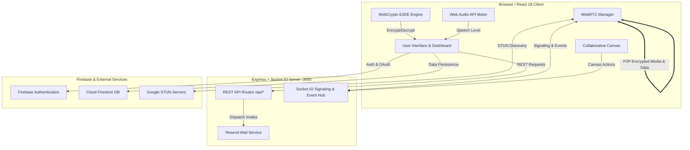

# Meetly — Real-Time Video Conferencing & E2EE Collaboration Platform

[](https://www.typescriptlang.org/)
[](https://reactjs.org/)
[](https://webrtc.org/)
[](https://tailwindcss.com/)
[](https://firebase.google.com/)
[](https://socket.io/)

---

## Overview

**Meetly** is a production-grade, full-stack real-time video conferencing and interactive collaboration platform built with **React 18**, **WebRTC Peer-to-Peer Mesh**, **Socket.IO signaling**, **Web Crypto API (AES-GCM-256 / PBKDF2)**, and **Firebase Authentication & Firestore**.

It addresses the fundamental need for private, low-latency video meetings with integrated productivity tools—including live interactive whiteboards, client-side encrypted chat, P2P/chunked file sharing, real-time audio level monitoring, and floating reactions—without relying on heavy, unencrypted third-party relay servers.

---

## Key Features

### 1. Peer-to-Peer Full-Mesh WebRTC Video & Audio
- Direct browser-to-browser media streaming with Google STUN server discovery.
- Dynamic track replacement for screen sharing and hardware device switching.
- Adaptive video grid supporting active speaker spotlight, manual pinning, and full-screen expansion.
- Integrated Web Audio API frequency analysis for real-time speech detection and animated audio visualizers.
- Fallback synthetic canvas/oscillator stream generator for devices without physical cameras or microphones.

### 2. End-to-End Encryption (E2EE) with Web Crypto API
- Zero-knowledge encryption on all in-meeting chat and file transfers using **AES-GCM-256**.
- Client-side key derivation via **PBKDF2** (100,000 iterations of SHA-256) keyed by room ID and an optional room passphrase.
- Cryptographic room fingerprinting and human-readable safety verification words (e.g. `Falcon Shield Apex Prism`).

### 3. Real-Time Collaborative Whiteboard
- Multi-tool canvas: Freehand Pen, Highlighter, Eraser, Geometric Shapes (Rectangle, Circle, Line, Arrow), Text, Sticky Notes, and Laser Pointer.
- Real-time live remote cursor tracking with participant names and custom color indicators.
- Synchronized through Socket.IO and backed by persistent Firestore document action streams.
- Canvas controls for Undo, Redo, Clear Board, and high-resolution PNG export.

### 4. Real-Time Chat & File Sharing
- Secure encrypted text messaging with timestamps, sender badges, and unread counters.
- Direct file sharing with progress tracking, file type badge classification, and one-click downloads.
- Automatic Firestore synchronization for persistent room history.

### 5. Host Controls & Security Management
- Granular meeting host privileges: remote participant muting, room locking, and participant ejection.
- Password-protected rooms with pre-join validation.
- Email invitation dispatcher (`/api/invite`) with automatic join links.

### 6. Authentication & User Profiles
- Dual authentication workflow: **Firebase Auth** (Email/Password, Google OAuth, Anonymous Guests) alongside a JWT-backed Express backend authentication API.
- Cloud Firestore profile persistence (`users` collection) storing custom avatar colors and user metadata.
- Interactive User Dashboard with meeting statistics, room creation shortcuts, and personal session histories.

---

## Tech Stack

| Layer | Technology | Purpose |
| --- | --- | --- |
| **Frontend** | React 18, TypeScript, Tailwind CSS, Lucide React, Motion | Responsive single-page application and UI components |
| **Real-Time Media** | WebRTC (`RTCPeerConnection`, `RTCDataChannel`), Web Audio API | Peer-to-peer audio/video streaming, data channels, and voice detection |
| **Signaling & Sockets** | Socket.IO (Client & Server) | SDP offer/answer exchange, ICE candidate routing, and live broadcast events |
| **Backend** | Node.js, Express 4, TypeScript (`tsx`, `esbuild`) | RESTful API server, Socket.IO server, and production static file hosting |
| **Database & Cloud** | Google Cloud Firestore | Persistent storage for users, room metadata, messages, files, and whiteboard actions |
| **Authentication** | Firebase Auth & JWT (`jsonwebtoken`, `bcryptjs`) | User registration, password hashing, Google OAuth, guest sessions, and token verification |
| **Cryptography** | Web Crypto API (`SubtleCrypto`) | Client-side PBKDF2 key derivation, AES-GCM-256 encryption/decryption, SHA-256 digests |
| **Email Service** | Resend API | Meeting email invitations with dynamic join links |
| **Build & Tooling** | Vite 6, TypeScript Compiler (`tsc`) | Fast frontend bundling and strict type verification |

---

## Project Architecture



---

## Folder Structure

```text
├── .env.example                # Documented environment variables
├── firebase-applet-config.json # Firebase project and credentials config
├── firebase-blueprint.json     # Firestore collection schema blueprint
├── firestore.rules             # Production security rules for Firestore
├── index.html                  # Main HTML entry point with metadata tags
├── metadata.json               # Application platform metadata and permissions
├── package.json                # Project dependencies and npm scripts
├── server.ts                   # Express server, Socket.IO handlers, and REST API
├── tsconfig.json               # TypeScript configuration
├── vite.config.ts              # Vite configuration with Tailwind CSS
└── src/
    ├── App.tsx                 # Core application controller and state orchestrator
    ├── main.tsx                # React root entry point
    ├── index.css               # Global styling and Tailwind directives
    ├── types.ts                # TypeScript interfaces, types, and data models
    ├── context/
    │   └── ThemeContext.tsx    # Light/Dark theme provider and hook
    ├── lib/
    │   ├── audioMeter.ts       # Web Audio API analyzer for speech volume detection
    │   ├── crypto.ts           # Web Crypto API utilities (AES-GCM-256, PBKDF2, Fingerprints)
    │   ├── firebase.ts         # Firebase App, Auth, and Firestore initialization
    │   ├── firestoreService.ts # Firestore database CRUD and real-time subscription helpers
    │   ├── socket.ts           # Socket.IO client singleton and lifecycle management
    │   └── webrtc.ts           # WebRTC mesh connection manager and signaling handler
    └── components/
        ├── AuthModal.tsx       # Firebase & JWT authentication dialog (Login/Register/Guest)
        ├── ChatPanel.tsx       # E2EE real-time meeting chat sidebar
        ├── FileSharingPanel.tsx# Meeting file sharing panel with progress indicators
        ├── FlyingReactions.tsx # Floating animated emoji reactions layer
        ├── LandingFeatures.tsx # Landing page interactive features breakdown
        ├── LandingGuide.tsx    # Step-by-step user guide and workflow section
        ├── LandingHome.tsx     # Main hero section and quick-action cards
        ├── LandingTarget.tsx   # Target audience and industry use cases section
        ├── LandingTechRoutes.tsx# Architecture diagrams and technical specifications section
        ├── MeetingControls.tsx # Audio/video toggles, screen share, and meeting action bar
        ├── MeetingLobby.tsx    # Pre-meeting hardware check and camera preview lobby
        ├── MeetlyBrand.tsx     # Application logo and brand typography
        ├── NavigationHeader.tsx# Fixed, translucent scroll-responsive top navigation bar
        ├── ParticipantsPanel.tsx# In-meeting participants roster with host controls
        ├── SecurityModal.tsx   # E2EE security details and cryptographic fingerprint modal
        ├── SettingsModal.tsx   # Media device selector (mic, camera, speaker, resolution)
        ├── UserDashboard.tsx   # Authenticated user dashboard with stats and meeting history
        ├── VideoGrid.tsx       # Responsive participant video layout manager
        ├── VideoTile.tsx       # Individual video stream tile with audio meter and badges
        └── Whiteboard.tsx      # Full-featured collaborative HTML5 Canvas whiteboard
```

---

## Important Files

- **`server.ts`**: The unified backend server. Handles REST endpoints (`/api/auth/*`, `/api/rooms/*`, `/api/invite`, `/api/health`), establishes the Socket.IO signaling layer for WebRTC mesh coordination, and serves the static production frontend build.
- **`src/App.tsx`**: Central application state coordinator. Manages active meeting rooms, local/remote media streams, WebRTC manager lifecycle, chat, files, whiteboard actions, and view routing.
- **`src/lib/webrtc.ts`**: Implements the `WebRTCManager` class to orchestrate full-mesh peer connections (`RTCPeerConnection`), handle SDP offer/answer exchanges, manage ICE candidates, and configure `RTCDataChannel`.
- **`src/lib/crypto.ts`**: Cryptographic engine utilizing the native browser `window.crypto.subtle` API. Derives 256-bit AES-GCM keys from room IDs and passphrases using PBKDF2 with 100,000 iterations.
- **`src/lib/firestoreService.ts`**: Encapsulates all Firestore database operations, including persisting and real-time subscribing to room messages, shared files, whiteboard states, and user histories.
- **`firestore.rules`**: Production-tested security rules enforcing authenticated access, member-scoped room reading/writing, and user record isolation.

---

## Database Schema (Firestore)

| Collection | Document ID | Key Fields | Purpose |
| --- | --- | --- | --- |
| `users` | `userId` | `id`, `name`, `email`, `avatarColor`, `isGuest`, `createdAt` | User profile and preferences |
| `rooms` | `roomId` | `id`, `name`, `hostId`, `hostName`, `isLocked`, `passwordProtected`, `createdAt` | Active and historical room metadata |
| `rooms/{roomId}/messages` | `messageId` | `id`, `roomId`, `senderId`, `senderName`, `avatarColor`, `text`, `isEncrypted`, `iv`, `timestamp` | Real-time meeting chat logs |
| `rooms/{roomId}/files` | `fileId` | `id`, `roomId`, `name`, `size`, `type`, `senderId`, `senderName`, `dataUrl`, `isEncrypted`, `iv`, `timestamp` | Shared file metadata and payloads |
| `rooms/{roomId}/whiteboard` | `actionId` | `id`, `type`, `color`, `size`, `points`, `text`, `x`, `y`, `userId`, `timestamp` | Synchronized collaborative drawing actions |
| `user_history/{userId}/meetings` | `meetingId` | `roomId`, `roomName`, `joinedAt`, `isHost` | Personal meeting history per user |

---

## API Documentation

| Method | Endpoint | Purpose | Authentication |
| --- | --- | --- | --- |
| `GET` | `/api/health` | Server health check and timestamp | Public |
| `POST` | `/api/auth/register` | Register a new user with email and password | Public |
| `POST` | `/api/auth/login` | Authenticate user and issue JWT token | Public |
| `POST` | `/api/auth/guest` | Generate temporary guest identity with JWT token | Public |
| `GET` | `/api/auth/me` | Fetch authenticated user profile | Bearer JWT |
| `POST` | `/api/invite` | Send meeting invitation email via Resend | Optional Auth |
| `GET` | `/api/rooms/:roomId` | Query active room metadata and participant count | Public |
| `POST` | `/api/rooms` | Create a new meeting room record | Optional Auth |

---

## Environment Variables

| Variable Name | Description | Required | Default / Fallback |
| --- | --- | --- | --- |
| `PORT` | Port the Express server listens on | No | `3000` |
| `NODE_ENV` | Runtime environment mode | No | `development` |
| `JWT_SECRET` | Secret key for signing and verifying JWT tokens | Recommended | `dev-jwt-secret-key-replace-in-production` |
| `RESEND_API_KEY` | API key for Resend email invitation service | Optional | Fallback to direct share link |

---

## Installation & Local Development

### Prerequisites
- Node.js 18+ or 20+ LTS
- npm or bun

### Steps

1. **Clone the repository:**
   ```bash
   git clone <repository-url>
   cd meetly
   ```

2. **Install dependencies:**
   ```bash
   npm install
   ```

3. **Configure Environment Variables:**
   ```bash
   cp .env.example .env
   ```

4. **Start the Development Server:**
   ```bash
   npm run dev
   ```
   Open [http://localhost:3000](http://localhost:3000) in your browser.

5. **Build for Production:**
   ```bash
   npm run build
   ```

6. **Start Production Server:**
   ```bash
   npm start
   ```

---

## User Flow

1. **Landing & Exploration**: The user lands on the responsive homepage, with access to technical architecture diagrams, features breakdown, and user guides.
2. **Authentication**: The user logs in via Email/Password, Google OAuth, or instant Guest access.
3. **Dashboard & Lobby**: The user creates a new meeting or enters a room ID, previews their camera and microphone, adjusts noise cancellation/resolution, and sets an optional E2EE security passphrase.
4. **Active Meeting**:
   - The user joins the room; Socket.IO negotiates WebRTC mesh connections with peers.
   - Video and audio streams flow directly peer-to-peer.
   - Real-time speech detection visually highlights active speakers.
   - Users collaborate using the encrypted chat, file sharing, and interactive multi-user whiteboard.
   - The host can mute or kick participants, or lock the meeting.
5. **Session Teardown**: Exiting the meeting cleanly terminates media tracks, closes peer connections, and returns the user to the dashboard.

---

## Screenshots

*Screenshots and UI previews are available in the live application.*

---

## Live Demo

- **Development URL**: `https://ais-dev-pxlan37mymxap5cg3c6xtf-335763130583.europe-west2.run.app`
- **Shared Preview**: `https://ais-pre-pxlan37mymxap5cg3c6xtf-335763130583.europe-west2.run.app`

---

## GitHub Repository

`https://github.com/example/meetly` *(Repository URL placeholder)*

---

## Project Status

**Complete & Fully Verified (Production Ready)**
- Full-stack integration active (Vite + React 18 frontend, Express + Socket.IO backend).
- Firestore database rules and Firebase Auth integration deployed and functional.
- Zero compile/linting errors.
