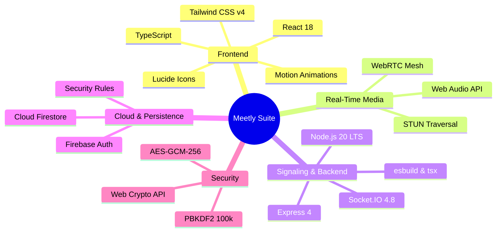
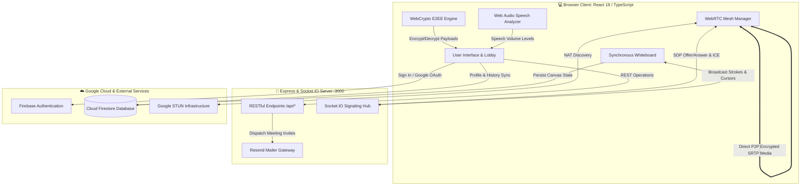

<div align="center">

# ⚡ MEETLY — Real-Time E2EE Video Conferencing & Visual Collaboration

<p align="center">
  <strong>Decentralized • Zero-Knowledge E2EE • WebRTC Full Mesh • Collaborative Whiteboard • Cloud Firestore</strong>
</p>

<p align="center">
  
  
  
  
  
  
  
</p>

<p align="center">
  <a href="#-overview">Overview</a> •
  <a href="#-core-features">Features</a> •
  <a href="#-tech-stack">Tech Stack</a> •
  <a href="#-architecture">Architecture</a> •
  <a href="#-security--e2ee-engine">Security & E2EE</a> •
  <a href="#-quick-start">Quick Start</a> •
  <a href="#-api-reference">API Reference</a> •
  <a href="#-database-schema">Database</a>
</p>

---

</div>

## 🌟 Overview

**Meetly** is an open, full-stack video conferencing and real-time collaboration suite. It combines direct **WebRTC Peer-to-Peer (P2P) Full Mesh** media transport with an ephemeral **Socket.IO** signaling engine, **client-side AES-GCM-256 / PBKDF2 encryption**, and cloud synchronization via **Firebase Authentication & Firestore**.

> 💡 **Core Philosophy**: True privacy means zero-knowledge media. Video and audio packets stream directly between participants' browsers over SRTP, while chat and shared files are encrypted on-device before ever touching the network.

---

## ✨ Core Features

| Category | Feature | Description |
| :--- | :--- | :--- |
| 📹 **Media & Streams** | **P2P Full Mesh WebRTC** | Direct browser-to-browser HD video & audio streaming with Google STUN route discovery. |
| 🖥️ **Screen Sharing** | **Instant Track Swapping** | Transceiver-level `RTCRtpSender.replaceTrack()` for screen sharing without SDP renegotiation. |
| 🎨 **Collaboration** | **Interactive Whiteboard** | Multi-user vector canvas with sticky notes, shapes, laser pointer, and live cursor tracking. |
| 🔐 **Cryptography** | **Zero-Knowledge E2EE** | Native Web Crypto API (AES-GCM-256 + PBKDF2 with 100k rounds) for chat and shared files. |
| 🎙️ **Audio Intelligence**| **Real-Time Speech Meter** | 60 FPS Web Audio API frequency analysis for visual active speaker indicators. |
| 📁 **File Transfers** | **Encrypted Document Drop** | In-meeting encrypted file transfers with progress bars, file-type classification, and one-click downloads. |
| 🛡️ **Host Controls** | **Room Moderation Suite** | Granular host permissions: remote muting, kicking disruptive peers, and locking rooms. |
| 🔑 **Authentication** | **Hybrid Auth Flow** | Firebase Auth (Google OAuth, Email/Password, Guest Mode) + Express JWT token endpoints. |

---

## 🛠️ Tech Stack



| Layer | Technology | Purpose |
| :--- | :--- | :--- |
| **Frontend Framework** | `React 18.3` + `TypeScript 5` | Modular SPA architecture and typed state orchestration |
| **Styling & UI** | `Tailwind CSS 4`, `Lucide React`, `Motion` | Responsive, high-contrast theme and fluid UI transitions |
| **Media Transport** | `WebRTC` (`RTCPeerConnection`, `RTCDataChannel`) | Direct peer-to-peer audio/video streaming & data channels |
| **Audio Processing** | `Web Audio API` (`AudioContext`, `AnalyserNode`) | Real-time speech level monitoring and voice activity detection |
| **Signaling Engine** | `Socket.IO` (`v4.8.1`) | Ephemeral SDP exchange, ICE candidate routing, and room state broadcasts |
| **Backend API** | `Node.js 20` + `Express 4` | REST endpoints, authentication services, and static asset delivery |
| **Cloud Storage & Auth**| `Google Cloud Firestore` & `Firebase Auth` | Persistent profiles, session records, and Firestore rules enforcement |
| **Cryptographic Engine**| `SubtleCrypto` (Web Crypto API) | On-device 256-bit AES-GCM encryption & PBKDF2 key derivation |
| **Email Service** | `Resend API` | Transactional email invitations with dynamic join links |

---

## 📐 Architecture & Data Flow



---

## 🔐 Security & E2EE Engine

<div align="center">

```
┌─────────────────────────────────────────────────────────────────────────┐
│                      Client-Side Web Crypto Pipeline                     │
├─────────────────────────────────────────────────────────────────────────┤
│                                                                         │
│   Room ID + Passphrase  ──►  PBKDF2 (100,000 Iterations / SHA-256)      │
│                                           │                             │
│                                           ▼                             │
│                                  256-bit AES-GCM Key                    │
│                                           │                             │
│            ┌──────────────────────────────┴─────────────────────────┐   │
│            ▼                                                        ▼   │
│   Random 12-byte IV                                        SHA-256 Hash │
│            │                                                        │   │
│            ▼                                                        ▼   │
│   AES-GCM Authenticated Encryption                  32-Char Fingerprint │
│            │                                                        │   │
│            ▼                                                        ▼   │
│   Base64 Ciphertext Payload                           4 Safety Word Digest│
│                                                                         │
└─────────────────────────────────────────────────────────────────────────┘
```

</div>

- **PBKDF2 Key Derivation**: Derives high-entropy keys using `window.crypto.subtle.deriveKey` with a fixed salt and 100,000 rounds of SHA-256.
- **AES-GCM-256 Authenticated Encryption**: Generates a cryptographically random 96-bit IV per message (`window.crypto.getRandomValues`) to prevent replay attacks and bit-flipping.
- **Safety Word Fingerprints**: Displays 4 mnemonic verification words (e.g. `Falcon Shield Apex Prism`) so peers can out-of-band verify connection integrity.

---

## 📁 Project Structure

```text
meetly/
├── 📄 package.json                 # Dependencies and build configuration
├── 📄 server.ts                    # Express REST backend + Socket.IO signaling hub
├── 📄 firestore.rules              # Production Firestore database security rules
├── 📄 firebase-applet-config.json  # Firebase project configuration
├── 📄 .env.example                 # Environment variables specification
└── 📂 src/
    ├── 📄 App.tsx                  # Master application state coordinator
    ├── 📄 types.ts                 # TypeScript data contracts & interfaces
    ├── 📂 context/
    │   └── 📄 ThemeContext.tsx     # Theme state and switcher
    ├── 📂 lib/
    │   ├── 📄 webrtc.ts            # WebRTC mesh peer connection orchestrator
    │   ├── 📄 crypto.ts            # Native Web Crypto E2EE & PBKDF2 logic
    │   ├── 📄 audioMeter.ts        # Web Audio API voice activity detector
    │   ├── 📄 socket.ts            # Socket.IO client singleton
    │   ├── 📄 firebase.ts          # Firebase app and auth initialization
    │   └── 📄 firestoreService.ts  # Firestore CRUD operations and real-time listeners
    └── 📂 components/
        ├── 📄 VideoGrid.tsx        # Responsive participant video grid
        ├── 📄 VideoTile.tsx        # Individual video stream component with audio meter
        ├── 📄 MeetingControls.tsx  # In-call media toggles, screen share & action bar
        ├── 📄 MeetingLobby.tsx     # Pre-meeting hardware preview & passphrase setup
        ├── 📄 Whiteboard.tsx       # Collaborative HTML5 canvas whiteboard
        ├── 📄 ChatPanel.tsx        # AES-GCM encrypted in-meeting chat
        ├── 📄 FileSharingPanel.tsx # In-meeting encrypted file sharing panel
        ├── 📄 ParticipantsPanel.tsx# Participant roster & host moderation actions
        ├── 📄 SecurityModal.tsx    # E2EE security details & fingerprint modal
        ├── 📄 UserDashboard.tsx    # User meeting history & room creation hub
        ├── 📄 AuthModal.tsx        # Multi-provider authentication dialog
        └── 📄 LandingHome.tsx      # Interactive hero landing page
```

---

## 🚀 Quick Start & Local Setup

### 📋 Prerequisites
- **Node.js**: `v18.0+` or `v20.0+ LTS`
- **npm** or **bun**

### 💻 Installation

1. **Clone the repository:**
   ```bash
   git clone https://github.com/example/meetly.git
   cd meetly
   ```

2. **Install dependencies:**
   ```bash
   npm install
   ```

3. **Set up Environment Variables:**
   ```bash
   cp .env.example .env
   ```
   *(Configure optional `RESEND_API_KEY` for email invites and `JWT_SECRET` for token signing)*

4. **Start the Development Server:**
   ```bash
   npm run dev
   ```
   *The server will boot on `http://localhost:3000`.*

5. **Build for Production:**
   ```bash
   npm run build
   npm start
   ```

---

## 📡 API Reference

| Method | Endpoint | Description | Auth Required |
| :--- | :--- | :--- | :--- |
| `GET` | `/api/health` | Server heartbeat and timestamp | ❌ Public |
| `POST` | `/api/auth/register` | Register user with email and password | ❌ Public |
| `POST` | `/api/auth/login` | Authenticate user and issue signed JWT | ❌ Public |
| `POST` | `/api/auth/guest` | Create instant anonymous guest session | ❌ Public |
| `GET` | `/api/auth/me` | Retrieve authenticated user profile | 🔒 Bearer JWT |
| `POST` | `/api/invite` | Send email invitation with dynamic join link | ❌ Optional |
| `GET` | `/api/rooms/:roomId` | Query room lock status and participant count | ❌ Public |
| `POST` | `/api/rooms` | Register room metadata with optional password | ❌ Optional |

---

## 🗄️ Database Schema (Firestore)

```
📂 users/{userId}
   ├── 🆔 id: string
   ├── 👤 name: string
   ├── 📧 email: string
   └── 🎨 avatarColor: string

📂 rooms/{roomId}
   ├── 🏷️ name: string
   ├── 👑 hostId: string
   ├── 🔒 isLocked: boolean
   ├── 🔑 passwordProtected: boolean
   │
   ├── 📂 messages/{messageId}     [Chat collection]
   │      ├── 💬 text: string (Ciphertext)
   │      ├── 🎲 iv: string (Base64 IV)
   │      └── 🛡️ isEncrypted: boolean
   │
   ├── 📂 files/{fileId}           [Shared files collection]
   │      ├── 📦 dataUrl: string (Encrypted payload)
   │      └── 📏 size: number
   │
   └── 📂 whiteboard/{actionId}    [Canvas actions stream]
          ├── ✏️ type: string
          ├── 🎨 color: string
          └── 📍 points: array
```

---

## 🌐 Live Preview & Deployment

- 🚀 **Live Demo Deployment**: `Not deployed yet / Coming soon`
- 📦 **Repository URL**: `https://github.com/<your-username>/meetly`

---

## 📄 License & Status

Distributed under the **MIT License**. Handcrafted full-stack project built with high-performance WebRTC, WebCrypto, React, and Node.js.
